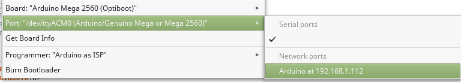

<a href="https://www.buymeacoffee.com/jurajandraY" target="_blank"></a>

# Arduino library to upload sketch over network to supported Arduino board

This library allows you to update sketches on your board over WiFi or Ethernet.

The library is a modification of the Arduino WiFi101OTA library.



## Contents

* [Supported micro-controllers](#supported-micro-controllers)
* [Supported networking libraries](#supported-networking-libraries)
* [Installation](#installation)
* [OTA Upload from IDE without 'network port'](#ota-upload-from-ide-without-network-port)
* [OTA update as download](#ota-update-as-download)
* [ATmega support](#atmega-support)
* [ESP8266 and ESP32 support](#esp8266-and-esp32-support)
* [nRF5 support](#nrf5-support)
* [Arduino 'network port'](#arduino-network-port)
* [Troubleshooting](#troubleshooting)
* [Boards tested](#boards-tested)

## Supported micro-controllers

* classic ATmega AVR with at least 64 kB of flash (Arduino Mega, [MegaCore](https://github.com/MCUdude/MegaCore) MCUs, MightyCore 1284p and 644)
* Arduino SAMD boards like Zero, M0 or MKR and the new "Nano 33 IoT" 
* nRF5 board supported by [nRF5 core](https://github.com/sandeepmistry/arduino-nRF5).
* RP2040 boards with [Pico core](https://github.com/earlephilhower/arduino-pico)
* STM32F boards with [STM32 core](https://github.com/stm32duino/Arduino_Core_STM32)
* boards supported by ESP8266 and ESP32 Arduino boards package  
* any board with MCU with SD bootloader

## Supported networking libraries

* Ethernet library - Ethernet shields and modules with Wiznet 5100, 5200 and 5500 chips
* WiFi101 - MKR 1000, Arduino WiFi101 shield and Adafruit WINC1500 WiFi shield or module
* WiFiNINA - MKR 1010, MKR 4000, Nano 33 IoT and any supported MCU with attached ESP32 as SPI network adapter with WiFiNINA firmware
* WiFiEspAT - esp8266 or ESP32 as network adapter with AT firmware
* WiFiLink - esp8266 as network adapter with WiFiLink firmware (SPI or Serial)
* EthernetENC and UIPEthernet - shields and modules with ENC28j60 chip
* WiFi - Arduino WiFi Shield (not tested)
* WiFi library of ESP8266 and ESP32 Arduino boards package

UIPEthernet, EthernetENC and WiFi library don't support UDP multicast for MDNS, so Arduino IDE will not show the network upload port. WiFiLink doesn't support UDP multicast, but the firmware propagates the MDNS record.

## Installation

The library is in Library Manager of the Arduino IDE.

Note for platformio users: Please, don't use this library with platformio. It was not tested with platformio and most of the documentation doesn't apply.  

Arduino SAMD boards (Zero, M0, MKR, Nano 33 IoT) are supported 'out of the box'. Additionally to upload over the internal flash as temporary storage, upload over SD card and over MEM shield's flash is possible. For upload over SD card use the SDU library as shown in the WiFi101_SD_OTA or similar for upload over MKR MEM shield use the SFU library.

For nRF5 boards two lines need to be added to platform.txt file of the nRF5 Arduino package. For details scroll down.

For RP2040 and STM32F1 boards, platform.local.txt from extras folder has to be copied into boards package installation folder.

For ESP8266 and ESP32 boards, platform.local.txt from extras folder has to be copied into boards package installation folder and the bundled ArduinoOTA library must be deleted. For details scroll down.

ATmega boards require to flash a modified Optiboot bootloader for flash write operations. Details are below.

For other MCU upload over SD card is possible if the MCU has SD bootloader which can bootload the update bin from SD card. See the ATmega-SD example. Some MCU can use a second stage SD bootloader linked to the sketch as a library similar to SAMD package's SDU library. For upload the 'fake OTA programmer' technique can be configured.

## OTA Upload from IDE without 'network port'

Some of the supported networking libraries don't have the UDP.beginMulticast function and can't start a MDNS service to propagate the network port for Arduino IDE. And sometimes the MDNS port is not detected for the good libraries too. Arduino IDE doesn't yet allow to enter the IP address. 

The workaround is to configure a fake programmer for Arduino OTA. You can use [my_boards](https://github.com/jandrassy/my_boards) as starting point. For Arduino Mega it is the best option for all ArduinoOTA aspects, for other boards it gives you control about your custom settings. In your copy of my_boards in programmers.txt, configure the IP address and restart the IDE. Note: the esp boards packages can't be used as referenced packages in my_boards style.

If you don't want to use my_boards, the platform.local.txt files for avr and samd in extras folder in this library contain the configuration for arduinoOTA tool as programmer. Copy platform.local.txt next to platform.txt in the hardware package of your board. The programmers.txt file can't have a 'local' extension so you have to add your OTA 'programmer' configuration into the existing programmers.txt file. Then restart the IDE.

Example OTA 'programmer' configuration in programmers.txt:
```
arduinoOTA104.name=Arduino OTA (192.168.1.104)
arduinoOTA104.program.tool=arduinoOTA
arduinoOTA104.ip=192.168.1.104
``` 

In IDE select in Tools menu the "Arduino OTA (...)" programmer and use "Upload using programmer" from the Sketch menu in IDE.

## OTA update as download

*Note: Don't use this for esp8266 and esp32 Arduino. Use the ESP8266httpUpdate and the esp32 HTTPUpdate library for OTA update download for esp8266/esp32. Or use the Update object from esp8266 core ot the Update library directly.*

The WiFi101OTA and ArduinoOTA libraries were created for upload from IDE. But in some scenarios as for example deployed sleeping battery powered devices it is better to have the update available for download by the device.

In advanced section of examples you can find examples of sketch update over download from a http server. One example shows update over the InternalStorage object of the ArduinoOTA library. The example for update over SD card doesn't use this library at all.

The Blynk library uses this library in its Blynk.Edgent examples to store and apply user's updated sketch downloaded from the Blynk IoT cloud storage.

## ATmega support

The sizes of networking library and the SD library allows the use of ArduinoOTA library only with ATmega MCUs with at least 64 kB flash memory. 

*Side note: There are other network upload options for here excluded ATmega328p: ([Ariadne bootloader](https://github.com/loathingKernel/ariadne-bootloader) for Wiznet chips, [WiFiLink firmware](https://github.com/jandrassy/arduino-firmware-wifilink) for the esp8266) or [AvrDudeTelnet](https://github.com/jandrassy/lab/blob/master/AvrDudeTelnet/AvrDudeTelnet.ino) upload (Linux only).*

For upload with ArduinoOTA library over InternalStorage, Optiboot bootloader with [`copy_flash_pages` function](https://github.com/Optiboot/optiboot/pull/269) is required. MegaCore and MightyCore by [MCUDude](https://github.com/MCUdude) have Optiboot binaries with `copy_flash_pages` function ready to be burn to your ATmega.

The most common Arduino ATmega board with more than 64 kB of flash memory is Arduino Mega. To use it with ArduinoOTA library, you can't use it directly with the Arduino AVR package, because the package doesn't have the right fuse settings for Mega with Optiboot. You can download [my boards definitions](https://github.com/jandrassy/my_boards) and use it [to burn](https://arduino.stackexchange.com/questions/473/how-do-i-burn-the-bootloader) the modified Optiboot and to upload sketches to your Mega over USB and over network. 

For SDStorage a 'SD bootloader' is required to load the uploaded file from the SD card. There is no good SD bootloader. 2boots works only with not available old types of SD cards and zevero/avr_boot doesn't yet support USB upload of sketch. The SDStorage was tested with zevero/avr_boot. The ATmega_SD example shows how to use this ArduinoOTA library with SD bootloader.

To use remote upload from IDE with SDStorage or InternalStorage, copy platform.local.txt from extras/avr folder, next to platform.txt in the boards package used (Arduino-avr or MCUdude packages). You can find the location of boards packages in Arduino IDE Preferences as the location of the preferences.txt file at the bottom of the Preferences dialog. It is clickable and opens the folder. There find the boards package in packages folder. 

The IDE upload tool is installed with Arduino AVR core package. At least version 1.2 of the arduinoOTA tool is required. For upload from command line without IDE see the command template in extras/avr/platform.local.txt.

## ESP8266 and ESP32 support

The ArduinoOTA library bundled with ESP8266 and ESP32 Arduino packages works only with native WiFi libraries. This library allows to upload a sketch to esp8266 or esp32 over Ethernet with Ethernet or EthernetENC library. Upload over the native WiFi library works too.

To use this library instead of the bundled library, the bundled library must be removed from the boards package library folder. To override the configuration of OTA upload in platform.txt, copy the platform.local.txt file from extras folder of this library next to platform.txt file in boards package installation folder. You can find the location of boards packages in Arduino IDE Preferences as the location of the preferences.txt file at the bottom of the Preferences dialog. It is clickable and opens the folder. There find the boards package in packages folder.

This library supports SPIFFS upload to esp8266 and esp32, but the IDE plugins have the network upload tool hardcoded to espota. It can't be changed in configuration. To upload SPIFFS, call the plugin in Tools menu and after it fails to upload over network, go to location of the created bin file and upload the file with arduinoOTA tool from command line. The location of the file is printed in the IDE console window. Upload command example (linux):
```
~/arduino-1.8.8/hardware/tools/avr/bin/arduinoOTA -address 192.168.1.107 -port 65280 -username arduino -password password -sketch OTEthernet.spiffs.bin -upload /data -b
```
(the same command can be used to upload the sketch binary, only use `-upload /sketch`)

## nRF5 support

For SD card update use [SDUnRF5 library](https://github.com/jandrassy/SDUnRF5).

To use remote upload from IDE with SDStorage or InternalStorage, copy platform.local.txt from extras/nRF5 folder, next to platform.txt in the nRF5 boards package. You can find the location of boards packages in Arduino IDE Preferences as the location of the preferences.txt file at the bottom of the Preferences dialog. It is clickable and opens the folder. There find the boards package in packages folder.

If SoftDevice is not used, the sketch is written from address 0. For write to address 0 the sketch must be compiled with -fno-delete-null-pointer-checks. The setting is in extras/nRF5/platform.local.txt.

If you use SoftDevice, stop BLE before applying update. Use `ArduinoOTA.beforeApply` to register a callback function. For example in setup `ArduinoOTA.beforeApply(shutdown);` and add the function to to sketch:

```
void shutdown() {
  blePeripheral.end();
}
```

## Arduino 'network port'

The Arduino IDE detects the Arduino 'network port' using mDNS system. This requires the use of UDP multicast. From networking libraries supported for OTA upload only Ethernet, WiFiNina, WiFi101 and the esp libraries support multicast. For these libraries ArduinoOTA.h at defaults starts the mDNS service.

In some networks or on some computers UDP mDNS doesn't work. You can still use the ArduinoOTA library for upload from command line or with the fake programmer trick described elsewhere in this README.

It is possible to suppress use of the mDNS service by the library. Only define NO_OTA_PORT before the include like this: 
```
#define NO_OTA_PORT
#include <ArduinoOTA.h>
```

## Troubleshooting

To see the details of upload command in IDE, set verbose mode for upload in IDE Preferences. arduinoOTA tool version should be 1.2 or higher.

### No OTA network port in IDE tools menu

Not with all supported networking libraries this library can propagate a 'network port'. See the list in 'Supported networking libraries' section of this page. 

For networking libraries which support mDNS, sometimes the OS blocks or can't handle mDNS required to discover the 'network port'. Sometimes it helps to wait a little, sometimes it helps to restart the IDE, sometimes it helps disconnect and connect the network on the computer.

You have still the option to use a 'fake programmer' as described in "OTA Upload from IDE without 'network port'".

### arduinoOTA tool returns Unauthorized

The password doesn't match. Password is the third parameter in ArduinOTA begin() in sketch.

In platform.local.txt files in extras folder the password is configured as variable parameter for the normal OTA upload. The IDE asks for password and supplies the variable's value. The examples expect password "password". 

platform.txt in my_boards and the fake programmer tool definition in platform.local.txt have the password set as "password" to match the examples.

### arduinoOTA tool returns "Failed to reset the board, upload failed"

The wrong upload command from AVR boards platform.txt is used. Did you copy `extras/avr/platform.local.txt` next to platform.txt as required?

### Upload returns OK but the sketch is not replaced.

The final loading of the uploaded binary is in some cases not under control of the ArduinoOTA library. 

For SD card way the SD bootloader or the SDU library is responsible for loading the new binary. So SD bootloader must be present and in case of SDU, the uploaded sketch must contain the SDU library.

For AVR InternalStorage upload the final loading is done by the Optiboot with `copy_flash_pages` function. Optiboot 8 without `copy_flash_pages` will successfully store the binary to upper half of the flash but will not copy it to run location in flash. 
 
### Only the first OTA upload works

Does the OTA uploaded sketch have ArduinoOTA?


## Boards tested

* SAMD21
    - Arduino MKR Zero
    - Crowduino M0 SD
    - Arduino Nano 33 IoT
    - [Arduino MKR WiFi 1010](https://github.com/jandrassy/ArduinoOTA/issues/46)
    - Arduino MKR WiFi 1000 (with Blynk.Edgent)
    - [Adafruit Feather M0 Express](https://github.com/jandrassy/ArduinoOTA/discussions/77)
* SAMD51
    - [Seeed Wio Terminal](https://github.com/jandrassy/ArduinoOTA/pull/104) (with Blynk.Edgent)
* RP2040
    - Raspberry Pi Pico
* STM32
    - BluePill F103CB (128kB flash)
    - BlackPill F411CE
* nRF5
    - Seeed Arch Link (nRF51 board)
    - [nrf52832 board](https://github.com/jandrassy/ArduinoOTA/issues/1)
* ATmega
    - Arduino Mega
    - Badio 1284p
* esp8266
    - Wemos D1 mini
* esp32
    - ESP32 Dev Module
* STM32 Blue Pill - tested only upload to SD card, without the final bootload 

## Contribution

Please report tested boards.

Other ARM based MCUs could be added with code similar to SAMD and nRF5. 
